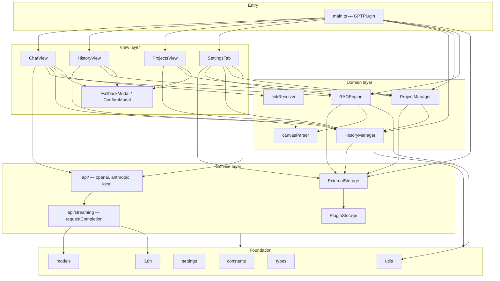
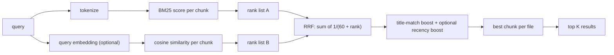
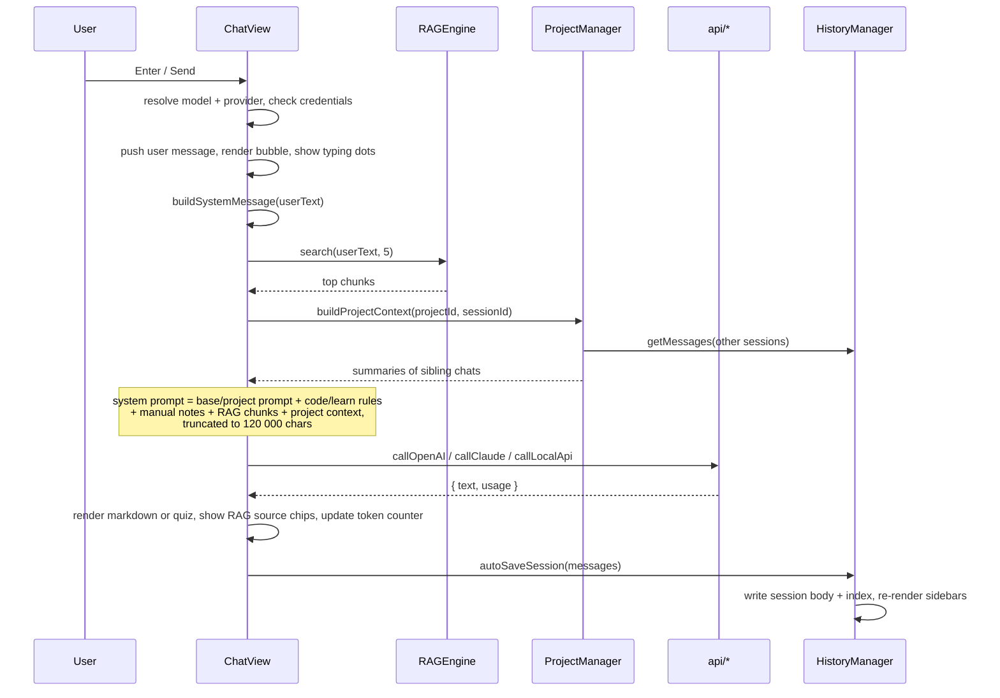
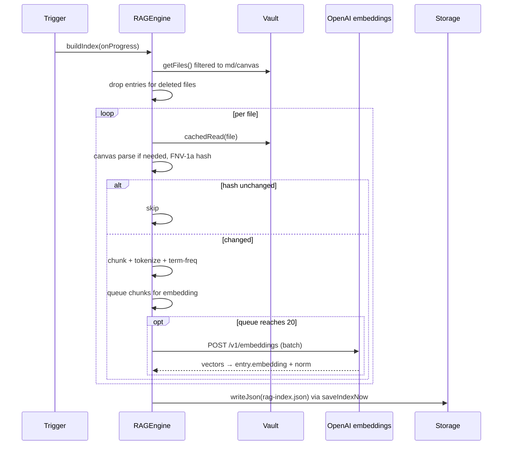
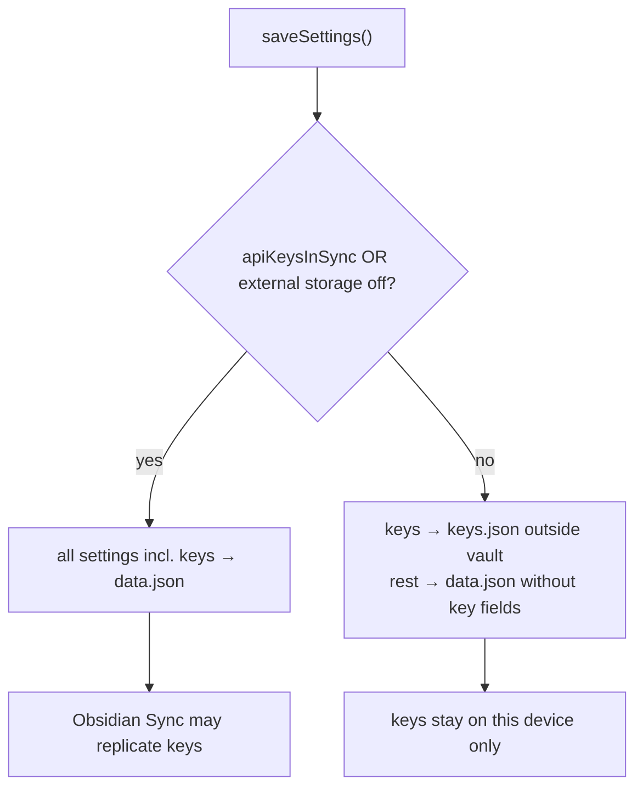

# AI-Vault — Architecture

> Reference document for the plugin's structure, layers, data flow and persistence model.
> Reflects the source tree at version **1.0.9** (`manifest.json`), branch `main`, commit `064aa87`.
> Companion document: [`CODE-ANALYSIS.md`](CODE-ANALYSIS.md) — findings, risks and technical debt.

---

## 1. What this is

AI-Vault is an Obsidian **community plugin** that embeds a multi-provider AI chat panel inside the
workspace and feeds it context from the user's own notes.

| Property | Value |
| --- | --- |
| Plugin id | `ai-vault` |
| Min Obsidian version | 1.7.2 (needs `Workspace.revealLeaf`) |
| Platform | `isDesktopOnly: true` |
| Providers | OpenAI, Anthropic, any OpenAI-compatible / Ollama endpoint |
| Runtime deps | none — everything ships inside `main.js` |
| Language | TypeScript, `strict: true` |
| UI languages | English, Polish |

Three hard constraints shape almost every design decision in the codebase:

1. **No `fetch()`.** Obsidian's review guidelines require `requestUrl()` for network access. `requestUrl`
   cannot expose a readable stream, so *all* provider calls are single-shot JSON requests
   (`src/api/streaming.ts`). Token-by-token streaming is architecturally impossible in this design.
2. **No `innerHTML`.** All DOM is built with Obsidian's `createEl`/`createDiv` helpers or explicit
   `createElement` + `textContent`. Rich text that needs inline markup goes through a hand-written
   safe tokenizer (`SettingsTab.renderSafeInlineMarkup`).
3. **Desktop-only because of storage.** The plugin's default is to keep chat history, projects, the RAG
   index and API keys in a folder *outside* the vault, so Obsidian Sync never touches them. That needs
   Node `fs`, which only exists in the desktop app — hence `isDesktopOnly`.

---

## 2. Tech stack and build pipeline

```
src/*.ts  ──esbuild──▶  main.js  (CJS bundle, single file)
styles.css ─────────▶  styles.css (shipped verbatim)
manifest.json ──────▶  manifest.json
```

**`esbuild.config.mjs`**

- Entry `src/main.ts`, `format: "cjs"`, `target: "es2022"`, `bundle: true`, `treeShaking: true`.
- Externals: `obsidian`, `electron`, all `@codemirror/*` and `@lezer/*` packages, plus an explicit
  `nodeBuiltins` allow-list (`fs`, `fs/promises`, `path`, `os`, `crypto`, `events`, `stream`, `util`,
  `http`, `https`). This is what lets `ExternalStorage` use static `import * as nodeFsModule from
  "fs/promises"` — esbuild turns it into a `require()` that Electron resolves at runtime.
- `npm run dev` → watch mode with inline sourcemap; `npm run build` → `tsc --noEmit` gate, then a
  minified production rebuild.

**Quality gates**

| Command | What it does |
| --- | --- |
| `npm run typecheck` | `tsc --noEmit --skipLibCheck` — currently clean |
| `npm run lint` | `eslint src` with `eslint-plugin-obsidianmd` — 0 errors, 138 warnings (nearly all `prefer-create-el`) |
| `npm run build` | typecheck + minified bundle |

**CI (`.github/workflows/`)**

- `validate.yml` — on every push/PR to `main`: manifest version must be plain semver, `package.json`
  must match, `versions.json` must contain the version, and a git tag with that version must already
  exist. This deliberately prevents hand-bumping the version.
- `release.yml` — on published release: semver check, "stable releases must come from `main`", writes
  the tag version into `manifest.json`/`package.json`/`package-lock.json`/`versions.json`, builds,
  attaches **build provenance attestations** for `main.js` and `styles.css`, commits version files
  back to `main`, uploads the three release assets.

`main.js` is git-ignored and produced only by the build — the repo tracks sources plus `styles.css`.

---

## 3. Repository layout

```
.
├── src/
│   ├── main.ts               431  plugin entry — lifecycle, commands, views, sessions, settings I/O
│   ├── SettingsTab.ts         739  settings UI (9 sections)
│   ├── i18n.ts                722  EN + PL dictionaries (296 keys each) + t() runtime
│   ├── settings.ts             93  PluginSettings shape, defaults, provider/mode unions
│   ├── types.ts                99  domain types: messages, sessions, projects, RAG, usage
│   ├── models.ts              120  model catalogues, provider detection, thinking modes, ModelAccessError
│   ├── constants.ts            23  view types, file names, RAG tuning constants
│   ├── utils.ts               236  debounce, retry, hashing, tokenizer, BM25, cosine, chunking
│   ├── storage/
│   │   ├── PluginStorage.ts    93  vault-adapter storage (always available)
│   │   ├── ExternalStorage.ts 393  Node fs storage outside the vault + migration
│   │   └── index.ts             3  barrel (unused)
│   ├── api/
│   │   ├── streaming.ts       142  shared requestUrl transport, error mapping, usage parsing
│   │   ├── openai.ts          174  Chat Completions + Responses API
│   │   ├── anthropic.ts        79  Messages API, extended thinking, server-side web search
│   │   ├── local.ts           211  OpenAI-compatible + Ollama, model discovery
│   │   └── index.ts             5  barrel (unused)
│   ├── rag/
│   │   ├── RAGEngine.ts       480  index build/load/save, incremental updates, hybrid search
│   │   ├── canvasParser.ts    158  .canvas JSON → readable text via graph traversal
│   │   ├── linkResolver.ts     47  recursive [[wikilink]] expansion via MetadataCache
│   │   └── index.ts             4  barrel (unused)
│   ├── history/
│   │   ├── HistoryManager.ts  151  session index + lazy per-session message files
│   │   ├── ProjectManager.ts  152  projects CRUD + cross-chat project context
│   │   └── index.ts             2  barrel (unused)
│   └── views/
│       ├── ChatView.ts       1524  the chat panel — largest module by far
│       ├── ProjectsView.ts    321  projects sidebar + create/edit dialog
│       ├── HistoryView.ts     132  history sidebar
│       ├── FallbackModal.ts   100  "model unavailable → switch to fallback" dialog
│       ├── ConfirmModal.ts     40  generic confirm dialog (replaces native confirm())
│       └── index.ts             3  barrel (unused)
├── styles.css                 652  228 top-level .gpt-* class selectors
├── esbuild.config.mjs
├── eslint.config.mjs
├── tsconfig.json
├── manifest.json / versions.json / package.json
├── README.md / CHANGELOG.md / RELEASE_NOTES_1.0.7.md
└── .github/workflows/{validate,release}.yml
```

Total: **6 677 lines** of TypeScript across 29 files (6 of which are unused barrels).

---

## 4. Layer model

The codebase is a clean five-layer stack. Dependencies point downward only; there are no cycles.



**How the layers are wired.** Views and managers never import the concrete `GPTPlugin` class. Each one
declares a **local structural interface** describing only what it needs — e.g. `RAGEngine`'s
`PluginWithDeps` asks for `app`, `externalStorage` and three settings fields; `HistoryManager`'s
`PluginWithStorage` asks for `externalStorage` alone. `GPTPlugin` satisfies all of them by shape. This
keeps the dependency graph acyclic without a DI container and makes each module independently
testable — though no tests exist yet.

---

## 5. Module reference

### 5.1 Entry point — `main.ts`

`GPTPlugin extends Plugin` holds the whole object graph plus three pieces of session state
(`currentSessionId`, `currentSession`, `activeProjectId`).

**`onload()` runs a strictly ordered boot sequence** — later steps depend on earlier ones:

1. `new PluginStorage(this)` — vault adapter, cannot fail.
2. `loadSettings()` — `loadData()`, strip legacy `gpt-rag-index-v1` / `gpt-history-v1` keys that older
   versions dumped into `data.json`, merge over `DEFAULT_SETTINGS`, then migrate a legacy standalone
   `ollama` provider onto the unified Local API settings.
3. `setLanguage()` — sets the i18n locale *and* rewrites `systemPrompt` if it still equals a default.
4. `new ExternalStorage(...)` + `init()` — returns whether external storage is actually live.
5. `_loadApiKeys()` — resolves where keys live (see §7.2).
6. `_maybeAutoMigrate()` — one-shot move of vault-side data into the external folder, guarded by the
   `_externalMigrationDone` flag.
7. Managers: `RAGEngine`, `HistoryManager`, `ProjectManager`, then `history.load()` + `projects.load()`.
8. A 3 s `debounce` wrapper for `rag.updateFile`.
9. Optional background index load/build when `ragEnabled && ragAutoIndex`.
10. `registerView` × 3, ribbon icons × 3, commands × 5, vault events × 3, `editor-menu` items × 2,
    `addSettingTab`.

**Commands:** open chat / history / projects, new chat, analyze selection, summarize note
(`editor.getValue().slice(0, 8000)`), re-index vault. The editor commands activate the chat view, wait
300 ms for it to mount, then call `view.sendMessage(...)`.

**Vault events** are filtered to `.md` and `.canvas`: `modify` → debounced `rag.updateFile`,
`delete` → `rag.removeFile`, `rename` → `rag.renameFile`.

**`onunload()`** cancels the debounce and flushes the RAG index with `saveIndexNow()`.

**Session handling.** `newChat()` creates an in-memory session; `loadSession(id)` hydrates it via
`history.getFullSession`; `autoSaveSession(messages)` stamps `updatedAt`, records the model actually
used, derives a title from the first user message when it is still `"New conversation"`, persists, and
re-renders both sidebars.

### 5.2 Foundation layer

**`settings.ts`** — the single source of truth for configuration: `PluginSettings` (25 fields),
`DEFAULT_SETTINGS`, the string-union types (`Provider`, `ThinkingMode`, `LocalApiType`, `Language`,
`RAGSearchMode`), default local base URLs, and `DEFAULT_SYSTEM_PROMPTS` per language.

**`constants.ts`** — view type ids (`gpt-chat-view`, …), on-disk file names (`rag-index.json`,
`history-index.json`, `projects.json`, `keys.json`, `history/`), legacy `data.json` keys, and RAG
tuning (`RAG_TOP_K = 5`, `RAG_CHUNK_SIZE = 1200`, `RAG_CHUNK_OVERLAP = 150`).

**`types.ts`** — `ChatMessage`, `ChatSession` / `SessionMeta` / `HistoryIndex`, `Project` /
`ProjectsFile`, `RAGEntry` / `RAGIndex` / `RAGSearchResult`, `UsageStats`, `APICallOptions`. Note the
`_tf` / `_embNorm` fields on `RAGEntry`: underscore-prefixed cache fields deliberately stripped before
serialization and rebuilt on load.

**`models.ts`** — capability sets (`WEB_SEARCH_CAPABLE`, `GPT5_MODELS`), `isGPT5` / `isGPT5Search`,
`detectProvider(model)` (prefix rules: `claude*` → anthropic, `gpt-`/`o1`/`o3`/`o4`/`chatgpt-`/
`text-davinci` → openai, everything else → local), `mapEffortForGPT5`, the `THINKING_MODES` table
(lazy `label`/`desc` getters so switching language needs no rebuild), and the `ModelAccessError` class
carrying `model` / `status` / `code`.

**`utils.ts`** — pure helpers, no Obsidian imports:

- `debounce` with a `.cancel()` method; `sleep`.
- `withRetry` — exponential backoff `baseDelay · 2^attempt + jitter`, capped at 30 s, 3 retries;
  never retries `AbortError` or anything flagged `noRetry`.
- `contentHash` — FNV-1a 32-bit, used for change detection.
- `tokenize` — Unicode-aware (`\p{L}\p{N}`, so Polish diacritics survive), drops tokens shorter than
  3 chars and a combined PL+EN stopword set.
- `buildTermFreq`, `bm25Score` (k1 = 1.5, b = 0.75), `dotProduct`, `vectorNorm`, `cosineSim` with
  optional precomputed norms.
- `chunkText` — splits on H1/H2 boundaries first, then by paragraph with a character overlap tail.
- `formatDate`, plus `escapeHtml` / `sanitizeUrl` / `utf8ToBase64` / `base64ToUtf8` (see
  `CODE-ANALYSIS.md` — most of these are now unreachable).

**`i18n.ts`** — two flat dictionaries (`en`, `pl`) of 296 keys each. Values are either strings or
arrow functions for parameterized messages. `t(key, ...args)` falls back `pl → en → key`, so a missing
Polish key degrades to English rather than throwing. `setLanguage()` also swaps the default system
prompt when the user has not customized it.

### 5.3 Storage layer

Two implementations behind a common informal interface
(`resolve`, `ensureDir`, `exists`, `readJson`, `writeJson`, `remove`, `list`).

**`PluginStorage`** wraps `app.vault.adapter`. Paths are vault-relative and rooted at
`manifest.dir` (`.obsidian/plugins/ai-vault`). Works on every platform; every method swallows errors
and returns a safe fallback.

**`ExternalStorage`** writes to a real filesystem path *outside* the vault.

- **Module loading.** `fs/promises` and `path` are imported statically, then validated at runtime by
  structural type guards (`isNodeFsPromises`, `isNodePathApi`) with a `getModuleApi` helper that also
  looks under `.default` for CJS-interop shapes. The comment in `_loadNodeModules` records why:
  dynamic `import()` was unreliable across Electron versions and used to leave the settings toggles
  permanently disabled.
- **Base directory.** `settings.externalStoragePath` if set, otherwise
  `dirname(vaultPath)/<vaultName>-gpt-data`, derived from `FileSystemAdapter.getBasePath()`.
- **Transparent fallback.** `isEnabled` is `_enabled && _desktop`. Every method checks it and
  otherwise delegates to the injected `PluginStorage`, including `resolve()` — so callers such as
  `HistoryManager` never branch on platform.
- **Atomic writes.** `writeJson` does `mkdir -p` then writes `<file>.tmp` and renames over the target,
  so a crash mid-write cannot leave truncated JSON.
- **Error discipline.** `ENOENT` is silent; anything else is logged with context. `lastError` is
  surfaced in the settings UI so a failed init can be diagnosed.
- **`migrateFromVault()`** moves `history-index.json`, `projects.json`, `rag-index.json` and every file
  in `history/` from the vault into the external folder, deleting the source only after a confirmed
  write, and returns `{ moved, skipped, errors }`.

### 5.4 Domain layer

**`HistoryManager`** — split index/body design:

- `sessions: SessionMeta[]` — the lightweight index (`history-index.json`), held in memory.
- Message bodies live in `history/session-<id>.json`, loaded lazily and memoized in `messagesCache`.
- `sessionPath()` sanitizes the id with `replace(/[^a-zA-Z0-9_-]/g, "")` before building a path.
- `getMessages()` distinguishes *"file absent → genuinely empty, safe to cache `[]`"* from
  *"read failed → return `[]` but do **not** cache"*, with a comment explaining that caching a
  transient failure would let the next save overwrite real history.
- `saveSession()` writes the body, upserts the meta entry, and caps the index at 100 sessions,
  deleting the evicted bodies.

**`ProjectManager`** — projects CRUD over `projects.json`, colors picked from a fixed 8-value palette.
`deleteProject` detaches sessions by nulling their `projectId` and saves both files.
`buildProjectContext(projectId, currentSessionId, maxChars = 4000)` walks the project's *other*
sessions newest-first, summarizes each (`summarizeSession` = last 6 messages, each truncated to 300
chars) and concatenates until the budget is exhausted — this is what gives a project cross-chat memory.

**`RAGEngine`** — the most algorithmically dense module.

*Index format* (`rag-index.json`):

```jsonc
{
  "_version": 2,
  "entries": [{ "path", "basename", "extension", "folder", "mtime", "chunk", "tokens", "embedding" }],
  "hashes":  { "<file path>": "<FNV-1a hex>" }
}
```

`loadIndex()` accepts v2 objects **and** the legacy flat array (silent migration), then rebuilds the
`_tf` / `_embNorm` caches for every entry.

*Saving* is debounced: `scheduleSave()` coalesces writes on a 5 s timer; `saveIndexNow()` cancels the
timer and flushes (used by `onunload` and at the end of a build). `saveIndex()` projects entries onto
their persistable fields, dropping the underscore caches.

*Building* (`buildIndex(onProgress?)`) is guarded by an `indexing` flag. It enumerates `.md`/`.canvas`
files, drops index entries for files that disappeared, then per file: `cachedRead` → canvas parse if
needed → `contentHash` → skip if unchanged → re-chunk → tokenize → push entries. Embedding requests
are queued into batches of 20 and flushed through
`text-embedding-3-small`; a failed batch is logged and the entries simply stay lexical-only.

*Searching* (`search(query, topK = 5)`) is a hybrid ranker:



Reciprocal Rank Fusion is used deliberately instead of a weighted score sum: it is scale-invariant, so
BM25 magnitudes and cosine values never need normalizing against each other. `ragSearchMode` gates the
two arms — `hybrid` (both), `semantic` (embeddings only), `exact` (lexical only), `recent` (hybrid plus
a freshness bonus). Results are deduplicated to the best-scoring chunk per file.

*Incremental updates* — `updateFile` re-chunks and re-embeds a single file (skipping unchanged
content by hash), `removeFile` and `renameFile` patch the index in place; all three call
`scheduleSave()`.

**`canvasParser.parseCanvasToText(raw, basename)`** turns Obsidian Canvas JSON into prose so the model
sees structure rather than raw JSON: it builds successor/predecessor maps from `edges`, finds root
nodes (no predecessors) sorted left-to-right, walks the graph depth-first sorting siblings
top-to-bottom, appends orphan nodes, then emits a `# Canvas: <name>` document with a **flow section**
(`A —[label]→ B`) and a **content section** per node type (text / file / link / group).

**`linkResolver.resolveNoteWithLinks(app, file, depth = 1, visited)`** reads a note and expands its
`[[wikilinks]]` (alias form included) one level deep using `metadataCache.getFirstLinkpathDest`, with a
`visited` set for cycle safety. Using the metadata cache instead of scanning the vault was an explicit
1.0.7 fix.

### 5.5 API layer

**`streaming.ts` is the single network chokepoint.** `requestCompletion(url, headers, body,
extractText, onChunk, signal)`:

1. Fast-fails if the signal is already aborted.
2. Forces `stream: false` into the body and strips `stream_options`.
3. Issues `requestUrl({ throw: false })` and races it against an abort promise, always removing the
   abort listener in `finally`.
4. Maps non-2xx responses through `throwHttpError`, which digs `error.message` / `message` out of the
   JSON body and raises `ModelAccessError` for 403 / 404 / `model_not_found`, plain `Error` otherwise.
5. Catches provider-level errors that arrive with a 2xx status (`json.error`, `json.type === "error"`).
6. Delegates text extraction to the caller-supplied `extractText` — the per-provider response shape is
   the *only* thing that differs between providers.
7. Normalizes token accounting in `parseUsage`, accepting both `prompt_tokens`/`completion_tokens`
   (OpenAI) and `input_tokens`/`output_tokens` (Anthropic), plus reasoning tokens from either
   `completion_tokens_details` or `output_tokens_details`.
8. Calls `onChunk(text)` once with the complete answer, then returns `{ text, usage }`.

Every extractor validates the payload with local type guards rather than casting — there is no `any`
in this layer.

**`openai.ts`** picks one of four request shapes:

| Condition | Endpoint | Distinguishing params |
| --- | --- | --- |
| GPT-5 family **and** web search | `/v1/responses` | `input[]`, `instructions`, `max_output_tokens`, `reasoning.effort`, `tools:[web_search]` |
| `gpt-5-search-api` | `/v1/chat/completions` | `max_tokens`, `web_search_options: {}` |
| GPT-5 family, no web search | `/v1/chat/completions` | `max_completion_tokens`, `reasoning_effort` |
| everything else | `/v1/chat/completions` | `max_tokens`, optional `tools:[web_search]` |

Reasoning models get a padded token budget (`+12000` for high effort, `+4000` for medium) so the
reasoning tokens do not eat the visible answer.

**`anthropic.ts`** — `/v1/messages` with `anthropic-version: 2023-06-01`. The system message is lifted
out of `messages` into the top-level `system` field. In `think` mode it sends
`thinking: { type: "enabled", budget_tokens: tokens }` and raises `max_tokens` to `tokens + 8000`.
Web search is the server-side tool `web_search_20260209`, so Anthropic performs the searches inside the
same request. The extractor concatenates all `content[].type === "text"` blocks, which naturally skips
thinking and tool-use blocks.

**`local.ts`** — self-contained, does not use `requestCompletion`:

- `normalizeLocalBaseUrl` strips trailing slashes and appends `/v1` for the OpenAI-compatible type
  (Ollama keeps the bare host because it uses `/api/tags` and `/api/chat`).
- `buildLocalApiHeaders` adds `Authorization: Bearer …` only when a local key is configured.
- `fetchLocalModels` + `parseLocalModelList` discover models from `data[].id` or `models[].name` with
  explicit, user-facing error messages ("Load a model in LM Studio or run `ollama pull <model>`").
- `callLocalApi` posts to `/chat/completions` or `/api/chat` and extracts content with
  shape-validating helpers. 401/403 produce a dedicated authentication message.

### 5.6 View layer

**`ChatView` (`gpt-chat-view`, 1 524 lines)** owns the entire chat experience. Its UI is assembled in
`buildUI()` from seven regions: header (provider picker, model picker, RAG badge, history/projects
buttons, new chat), thinking-mode bar, project bar, RAG status line, manual-context bar, message list,
input area with the tool row.

State it holds: `messages`, `webSearchActive`, `learnMode`, `codeMode`, `manualNotes`, `currentMode`,
`abortController`, `lastUsage`, `lastRagSources`, plus picker bookkeeping
(`currentPicker`, `currentPickerKind`, `pickerCloseHandler`).

Notable mechanics:

- **Pickers** are appended to `doc.body` (not the panel) to escape Obsidian's CSS transforms, then
  positioned from `getBoundingClientRect()` via `setCssStyles`. A document-level `mousedown` handler
  closes them; it is registered on a `setTimeout(0)` so the opening click cannot immediately close it,
  and it is removed in both `closePicker()` and `onClose()`.
- **Lifecycle safety** — `onClose()` aborts any in-flight request so post-response code never touches a
  destroyed view, and `MarkdownRenderer` gets a `Component` registered via `addChild` so Obsidian
  disposes it automatically.
- **Markdown rendering** — `renderContent` uses `MarkdownRenderer.render` with a `renderMarkdown`
  fallback for older Obsidian versions, and degrades to `renderPlainTextContent` (text nodes + `<br>`)
  if rendering throws.
- **Learn mode / quizzes** — `tryRenderQuiz` attempts three JSON extraction strategies (fenced
  ```json block, a `{…"questions"…}` substring, whole-content parse). `normalizeQuestion` then
  reconciles the many shapes models actually emit: type aliases (`multiple_choice`, `tf`,
  `short_answer`, `fill_blank`, …), `answers`/`choices` as option arrays, and
  `correct_answer`/`correctAnswer` given as an index, a boolean, an exact string, a case-insensitive
  string or a letter `A`–`D`. Open answers are graded by a second model call with a strict JSON
  response contract.
- **Token counter** — real usage when the provider reports it, otherwise a `chars / 4` estimate.
- **Export** — renders the conversation to Markdown under `AI-Vault/<title> <date>.md`, sanitizing the
  filename and appending ` (n)` until the path is free.

**`HistoryView` (`gpt-history-view`)** lists project-less sessions with title, date and preview,
highlights the active one, deletes through `ConfirmModal`, and offers a shortcut into Projects.

**`ProjectsView` (`gpt-projects-view`)** renders one card per project — colored dot, chat count badge,
custom-prompt tag, up to 5 recent chats with per-chat delete — plus an active-project bar and a
create/edit dialog. Project color is passed to CSS as the custom property `--gpt-project-color` via
`setCssProps`, so theming stays in `styles.css`.

**`FallbackModal`** appears when OpenAI returns 403/404: it explains the failure, adds a Tier-1 hint
for GPT-5 models, shows the raw API message, and offers to retry on a fallback model
(`gpt-4o` for GPT-5 failures, otherwise `gpt-4o-mini`) with an optional "save as default" checkbox.

**`ConfirmModal`** is the mobile-safe replacement for `window.confirm()`; it disables the confirm
button while the async handler runs and always closes in `finally`.

**`SettingsTab`** renders nine sections in `display()`: language, key-storage warning, API-key sync
toggle, model selector, Local API block (only when the provider is `local`), generation settings
(thinking mode, three max-token fields, system prompt + reset), context window, RAG (toggles, live
stats, re-index), storage (status, enable toggle, custom path, manual migration). Every mutation
`await`s `saveSettings()` and most call `this.display()` to re-render. Two structural details worth
knowing: `renderSafeInlineMarkup` is a whitelist tokenizer that turns a small subset of inline markup
(`<strong>`, `<em>`, `<code>`, `<br>`, `&nbsp;`) into real DOM nodes without ever touching `innerHTML`;
and the "active model" dropdown mixes all three providers into one list with `__header__` sentinel
options that are rejected in `onChange`.

**`styles.css`** — 652 lines, 228 `.gpt-*` selectors, built entirely on Obsidian theme variables
(`--background-*`, `--text-*`, `--interactive-accent`) so light/dark themes work for free. Dynamic
values are injected as CSS custom properties from the views; no view writes `element.style` directly.

---

## 6. Key data flows

### 6.1 Sending a message



The system message is assembled in strict order in `buildSystemMessage()`:

1. project custom prompt, else global `systemPrompt`
2. code-mode ruleset (replaces the prompt) and/or learn-mode quiz contract (appended)
3. manually attached notes — canvases parsed to text, Markdown notes expanded one wikilink level,
   each note truncated to 3 000 chars
4. auto-RAG chunks, excluding files already attached manually
5. project context from sibling chats
6. hard truncation at `MAX_SYSTEM_CHARS = 120 000` with a marker appended

History sent to the model is `messages.slice(-maxContextMessages)`, or everything when the setting is 0.

### 6.2 Building the RAG index



Triggers: startup (when `ragEnabled && ragAutoIndex`), `ChatView.onOpen`, the re-index buttons in the
chat toolbar and settings, and the `reindex-vault` command. Live edits take the cheaper path:
`vault.on("modify")` → 3 s debounce → `updateFile`.

### 6.3 Settings and API keys



`_loadApiKeys()` mirrors this on startup: in Sync mode it deletes a stale `keys.json`; in local mode it
reads `keys.json`, migrating legacy keys out of `data.json` on first run, and deliberately keeps the
in-memory values when the read fails rather than blanking the user's keys.

---

## 7. Persistence model

### 7.1 File map

With external storage **enabled** (default, desktop):

```
<parent of vault>/<vault name>-gpt-data/
├── keys.json            API keys (only when apiKeysInSync = false)
├── history-index.json   SessionMeta[] — the session list
├── projects.json        Project[]
├── rag-index.json       { _version: 2, entries[], hashes{} }
└── history/
    └── session-<id>.json   ChatMessage[] per session

<vault>/.obsidian/plugins/ai-vault/
└── data.json            PluginSettings (keys omitted in local-key mode)
```

With external storage **disabled** (or on an unsupported platform) every file except `data.json` moves
into `<vault>/.obsidian/plugins/ai-vault/`, at the same relative paths, because `ExternalStorage`
delegates `resolve()` to `PluginStorage`.

### 7.2 Storage decision matrix

| Data | Location when external storage on | When off | Rationale |
| --- | --- | --- | --- |
| Settings | `data.json` in vault | same | must survive with the vault, needed by Obsidian |
| API keys | `keys.json` outside vault | `data.json` | keep secrets out of Sync by default; user-overridable |
| History index + bodies | external folder | plugin folder | avoids consuming the Sync quota |
| Projects | external folder | plugin folder | same |
| RAG index | external folder | plugin folder | can grow large (embeddings are 1 536 floats per chunk) |

### 7.3 Migrations implemented

| From | To | Where | Trigger |
| --- | --- | --- | --- |
| `gpt-rag-index-v1` / `gpt-history-v1` keys inside `data.json` | deleted | `main.loadSettings` | every load |
| `provider: "ollama"` + `ollamaBaseUrl`/`ollamaModel` | unified Local API settings | `main._migrateLegacyOllamaSettings` | every load, non-destructive |
| keys in `data.json` | `keys.json` | `main._loadApiKeys` | first run in local-key mode |
| vault-side history/projects/index | external folder | `ExternalStorage.migrateFromVault` | auto once (`_externalMigrationDone`) or manual button |
| flat-array `rag-index.json` | `{ _version: 2, … }` | `RAGEngine.loadIndex` | on load |

---

## 8. Cross-cutting concerns

**Error handling.** Three deliberate tiers: storage operations never throw (log + safe fallback);
network calls throw typed errors that `withRetry` may replay and the views translate into notices or
the fallback modal; UI callbacks wrap async work in `.catch(console.error)` so no unhandled rejection
escapes. Every log line is prefixed `[AI-Vault]` (a few older RAG lines still say `[GPT RAG]`).

**Cancellation.** One `AbortController` per in-flight message, stored on the view. The stop button
aborts it; `requestCompletion` races the request against the abort; `withRetry` refuses to retry an
`AbortError`; `onClose` aborts on teardown.

**Concurrency guards.** `RAGEngine.indexing` prevents overlapping builds, `saveTimer` coalesces index
writes, the file-modify debounce throttles reindexing, and `ChatView` disables the send button while a
request is in flight.

**Obsidian API compliance** — the constraints that visibly shaped the code: `requestUrl` instead of
`fetch`; `createEl`/`setIcon`/`setCssProps`/`setCssStyles` instead of `innerHTML` and inline styles;
`window.setTimeout`/`window.clearTimeout` for popout-window safety; `containerEl.ownerDocument` instead
of the global `document`; `registerDomEvent` and `registerEvent` for automatic listener cleanup;
`Setting().setHeading()` for section headers; `Modal` instead of `confirm()`.

**Security posture.** No plugin backend — requests go straight from Obsidian to the configured
provider. Node `fs`/`path` usage is confined to `ExternalStorage`. Clipboard access is write-only.
`getFiles()` enumeration happens only for the user-enabled RAG index and the explicit note picker.
API keys are stored in plaintext (either `data.json` or `keys.json`) — the settings UI states this
explicitly and the choice of location is the user's.

---

## 9. Extension points

| Goal | Touch points |
| --- | --- |
| Add an OpenAI/Anthropic model | `ALL_MODELS` in `ChatView.ts`, the dropdown in `SettingsTab.renderModelSelector`, `WEB_SEARCH_CAPABLE`/`GPT5_MODELS` in `models.ts` if it changes capabilities, `model_desc_*` i18n keys |
| Add a provider | new `src/api/<provider>.ts` with an `extractText` for `requestCompletion`; extend `Provider` in `settings.ts`, `detectProvider`, `PROVIDER_OPTIONS`, the credential checks and dispatch in `ChatView.sendMessage`, and `SettingsTab` |
| Add a UI language | append a dictionary in `i18n.ts`, extend the `Language` union and `DEFAULT_SYSTEM_PROMPTS`, add the dropdown option |
| Add a RAG search mode | extend `RAGSearchMode`, handle it in `RAGEngine.search`, expose a control in `SettingsTab` (none exists today) |
| Change chunking or ranking | `chunkText` / `bm25Score` / `cosineSim` in `utils.ts`, `RAG_CHUNK_*` in `constants.ts`; bump `_version` in `RAGEngine` so old indexes are rebuilt |
| Add a persisted data file | add the name to `constants.ts`, go through `ExternalStorage`, and add it to `migrateFromVault` |

---

## 10. Architectural assessment in one page

**What is genuinely well done**

- Clear layering with zero import cycles, and structural interfaces instead of a god-object dependency.
- The dual-storage abstraction: one `resolve()`/`readJson()`/`writeJson()` surface, platform branching
  in exactly one place, atomic writes, and honest error reporting via `lastError`.
- One network chokepoint (`requestCompletion`) with per-provider extractors — provider differences are
  data, not control flow duplicated three times.
- Defensive parsing throughout: type guards rather than `any` casts on every external payload
  (HTTP responses, canvas JSON, RAG index, Node module shapes, model-generated quiz JSON).
- Migration discipline: five distinct legacy formats are handled non-destructively.
- Comments explain *why*, not *what* — especially around the Electron module-shape workaround, the
  message-cache poisoning hazard, and the RRF choice.

**Where the architecture is under strain**

- `ChatView` is 1 524 lines and mixes six responsibilities (layout, pickers, request orchestration,
  system-prompt assembly, markdown rendering, quiz engine). It is the natural first split: a
  `ChatController`, a `SystemPromptBuilder` and a `QuizRenderer` would each be independently testable.
- The `stream: false` reality has left dead scaffolding behind — the streaming render throttle, the
  partial-abort branch and the code-block copy pipeline are all unreachable. See `CODE-ANALYSIS.md`.
- Feature flags exist in the settings type without UI (`ragSearchMode`) or without effect
  (`autoDetectProvider`), so the configuration surface promises more than the code delivers.
- No test suite at all. The pure functions in `utils.ts`, `canvasParser`, `normalizeLocalBaseUrl`,
  `parseLocalModelList` and `normalizeQuestion` are trivially unit-testable and are exactly the code
  paths where silent regressions would hurt most.
