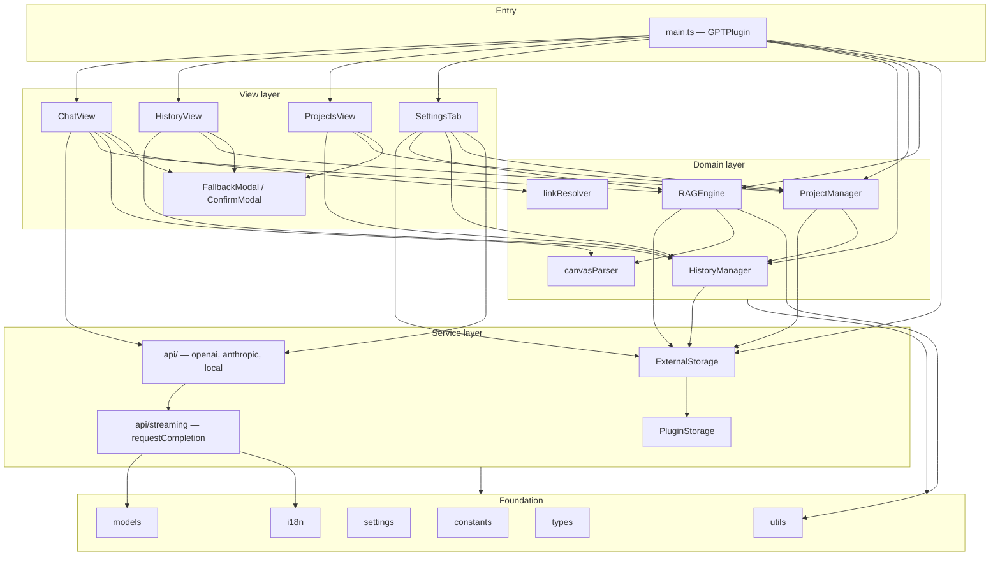
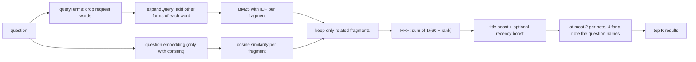
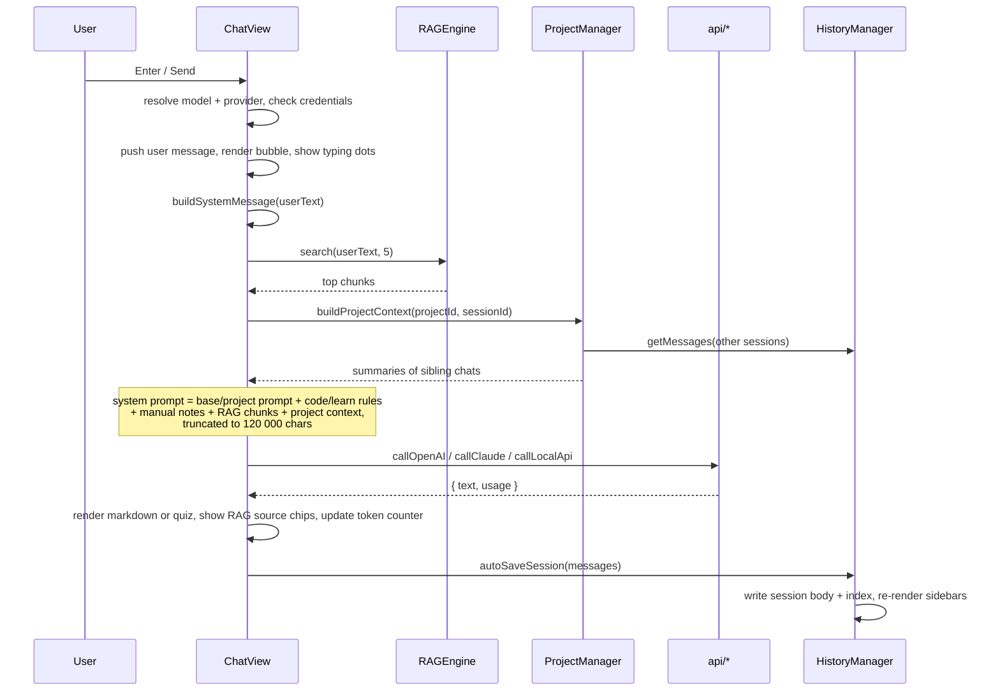
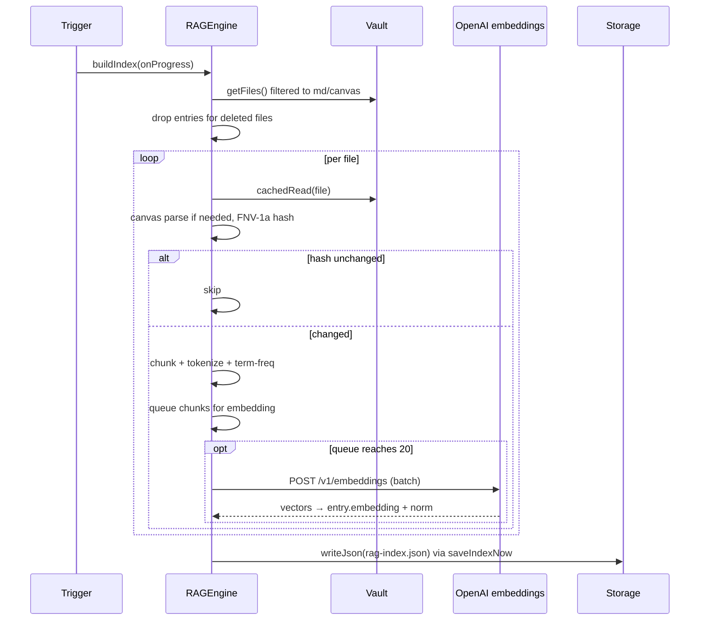
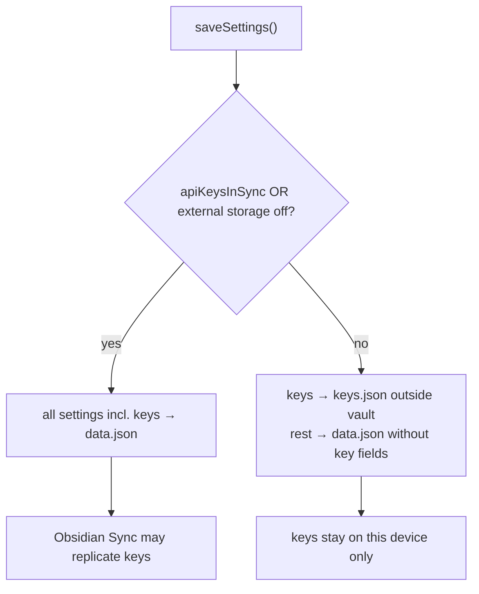

# AI-Vault — Architecture

> Reference document for the plugin's structure, layers, data flow and persistence model.
> Reflects the source tree at version **1.0.9** (`manifest.json`), branch `main`, commit `064aa87`.
> Companion document: [`CODE-ANALYSIS.md`](CODE-ANALYSIS.md) — findings, risks and technical debt.

---

## 1. What this is

AI-Vault is an Obsidian **community plugin** that embeds a multi-provider AI chat panel inside the
workspace and feeds it context from the user's own notes.

| Property | Value |
| --- | --- |
| Plugin id | `ai-vault` |
| Min Obsidian version | 1.7.2 (needs `Workspace.revealLeaf`) |
| Platform | `isDesktopOnly: true` |
| Providers | OpenAI, Anthropic, any OpenAI-compatible / Ollama endpoint |
| Runtime deps | none — everything ships inside `main.js` |
| Language | TypeScript, `strict: true` |
| UI languages | English, Polish |

Three hard constraints shape almost every design decision in the codebase:

1. **No `fetch()`.** Obsidian's review guidelines require `requestUrl()` for network access. `requestUrl`
   cannot expose a readable stream, so *all* provider calls are single-shot JSON requests
   (`src/api/streaming.ts`). Token-by-token streaming is architecturally impossible in this design.
2. **No `innerHTML`.** All DOM is built with Obsidian's `createEl`/`createDiv` helpers or explicit
   `createElement` + `textContent`. Rich text that needs inline markup goes through a hand-written
   safe tokenizer (`SettingsTab.renderSafeInlineMarkup`).
3. **Desktop-only because of storage.** The plugin's default is to keep chat history, projects, the RAG
   index and API keys in a folder *outside* the vault, so Obsidian Sync never touches them. That needs
   Node `fs`, which only exists in the desktop app — hence `isDesktopOnly`.

---

## 2. Tech stack and build pipeline

```
src/*.ts  ──esbuild──▶  main.js  (CJS bundle, single file)
styles.css ─────────▶  styles.css (shipped verbatim)
manifest.json ──────▶  manifest.json
```

**`esbuild.config.mjs`**

- Entry `src/main.ts`, `format: "cjs"`, `target: "es2022"`, `bundle: true`, `treeShaking: true`.
- Externals: `obsidian`, `electron`, all `@codemirror/*` and `@lezer/*` packages, plus an explicit
  `nodeBuiltins` allow-list (`fs`, `fs/promises`, `path`, `os`, `crypto`, `events`, `stream`, `util`,
  `http`, `https`). This is what lets `ExternalStorage` use static `import * as nodeFsModule from
  "fs/promises"` — esbuild turns it into a `require()` that Electron resolves at runtime.
- `npm run dev` → watch mode with inline sourcemap; `npm run build` → `tsc --noEmit` gate, then a
  minified production rebuild.

**Quality gates**

| Command | What it does |
| --- | --- |
| `npm run typecheck` | `tsc --noEmit --skipLibCheck` — currently clean |
| `npm run lint` | `eslint src` with `eslint-plugin-obsidianmd` — 0 errors, 131 warnings (nearly all `prefer-create-el`) |
| `npm run build` | typecheck + minified bundle |

**CI (`.github/workflows/`)**

- `validate.yml` — on every push/PR to `main`: manifest version must be plain semver, `package.json`
  must match, `versions.json` must contain the version, and a git tag with that version must already
  exist. This deliberately prevents hand-bumping the version.
- `release.yml` — on published release: semver check, "stable releases must come from `main`", writes
  the tag version into `manifest.json`/`package.json`/`package-lock.json`/`versions.json`, builds,
  attaches **build provenance attestations** for `main.js` and `styles.css`, commits version files
  back to `main`, uploads the three release assets.

`main.js` is git-ignored and produced only by the build — the repo tracks sources plus `styles.css`.

---

## 3. Repository layout

```
.
├── src/
│   ├── main.ts               431  plugin entry — lifecycle, commands, views, sessions, settings I/O
│   ├── SettingsTab.ts        1102  settings UI, built from setting definitions
│   ├── i18n.ts                788  EN + PL dictionaries (321 keys each) + t() runtime
│   ├── settings.ts            104  PluginSettings shape, defaults, provider/mode unions
│   ├── types.ts                73  domain types: messages, sessions, projects, RAG
│   ├── models.ts              307  model catalogue, retired models, provider detection, thinking modes
│   ├── constants.ts            20  view types, file names, RAG tuning constants
│   ├── utils.ts               255  debounce, ids, retry, hashing, tokenizer, BM25, cosine, chunking
│   ├── security/
│   │   ├── keyStore.ts       SecretStorage migration and lookup, verified by read-back
│   │   ├── paths.ts           112  path containment for storage
│   │   ├── redact.ts          113  secret redaction for errors and logs
│   │   └── urlPolicy.ts       175  Local API Base URL policy
│   ├── storage/
│   │   ├── PluginStorage.ts   151  vault-adapter storage (always available)
│   │   └── ExternalStorage.ts 464  Node fs storage outside the vault + migration
│   ├── api/
│   │   ├── streaming.ts       176  shared requestUrl transport, error mapping, usage parsing
│   │   ├── requests.ts        190  pure request-body builders for OpenAI and Anthropic
│   │   ├── contracts.ts       208  response validators, citations, Base URL shaping
│   │   ├── openai.ts           55  Responses API + Chat Completions
│   │   ├── anthropic.ts        81  Messages API: thinking, web search, refusal fallback
│   │   └── local.ts           202  OpenAI-compatible + Ollama, model discovery
│   ├── rag/
│   │   ├── RAGEngine.ts       608  index build/load/save, incremental updates, hybrid search
│   │   ├── search.ts               ranking: request words, word forms, relevance, limits
│   │   ├── locate.ts               finds an indexed fragment in the note's current text
│   │   ├── sources.ts              sources stored with an answer
│   │   ├── embeddings.ts       77  opt-in gate and wire format for embeddings
│   │   ├── ignorePaths.ts     138  ignored RAG paths
│   │   ├── canvasParser.ts    165  .canvas JSON → readable text via graph traversal
│   │   └── linkResolver.ts     51  recursive [[wikilink]] expansion via MetadataCache
│   ├── history/
│   │   ├── HistoryManager.ts  154  session index + lazy per-session message files
│   │   ├── retention.ts        38  which conversations are kept when history is full
│   │   └── ProjectManager.ts  153  projects CRUD + cross-chat project context
│   ├── chat/                       chat logic without Obsidian imports (except the collector)
│   │   ├── systemPrompt.ts     76  assembles the system prompt, holds its limits
│   │   ├── contextCollector.ts 73  gathers attached and retrieved note text, applies ignored paths
│   │   ├── quiz.ts            181  parses and normalizes model-written quizzes
│   │   ├── modelOptions.ts     99  what the model picker lists
│   │   └── exportNote.ts       58  conversation → Markdown note, safe file names
│   └── views/
│       ├── ChatView.ts        996  the chat panel: layout, controls, send flow, sessions
│       ├── ModelPicker.ts      90  the model list popup
│       ├── QuizRenderer.ts    122  draws a quiz and grades answers
│       ├── messageRenderer.ts  84  Markdown rendering, copy buttons
│       ├── sourceLinks.ts      64  source buttons, opening a note at a fragment
│       ├── sendSummary.ts      71  what the next message sends, and to whom
│       ├── NotePickerModal.ts  98  note attachment dialog
│       ├── EmbeddingsConsentModal.ts 64  consent dialog for semantic search
│       ├── ProjectsView.ts    321  projects sidebar + create/edit dialog
│       ├── HistoryView.ts     132  history sidebar
│       ├── FallbackModal.ts   100  "model unavailable → switch to fallback" dialog
│       └── ConfirmModal.ts     40  generic confirm dialog (replaces native confirm())
├── styles.css                 618  theme-variable based styles, .gpt-* classes
├── tests/                          unit tests (node:test), mirrors src/
├── esbuild.config.mjs
├── eslint.config.mjs
├── tsconfig.json
├── manifest.json / versions.json / package.json
├── README.md / CHANGELOG.md / PRIVACY.md / SECURITY.md / LICENSE
├── docs/                            developer documentation
└── .github/workflows/{validate,release,security-privacy}.yml
```

Total: **9 642 lines** of TypeScript across 47 files in `src/`.

---

## 4. Layer model

The codebase is a clean five-layer stack. Dependencies point downward only; there are no cycles.


```mermaid
graph TD
    subgraph L5["View layer"]
        CV["ChatView"]
        HV["HistoryView"]
        PV["ProjectsView"]
        MOD["FallbackModal / ConfirmModal"]
        ST["SettingsTab"]
    end

    subgraph L4["Entry"]
        MAIN["main.ts — GPTPlugin"]
    end

    subgraph L3["Domain layer"]
        HM["HistoryManager"]
        PM["ProjectManager"]
        RAG["RAGEngine"]
        CANVAS["canvasParser"]
        LINKS["linkResolver"]
    end

    subgraph L2["Service layer"]
        API["api/ — openai, anthropic, local"]
        TRANS["api/streaming — requestCompletion"]
        ES["ExternalStorage"]
        PS["PluginStorage"]
    end

    subgraph L1["Foundation"]
        UTIL["utils"]
        MODELS["models"]
        SET["settings"]
        CONST["constants"]
        TYPES["types"]
        I18N["i18n"]
    end

    MAIN --> CV & HV & PV & ST
    MAIN --> HM & PM & RAG
    MAIN --> ES --> PS
    CV --> API & RAG & CANVAS & LINKS & MOD
    HV --> HM & PM & MOD
    PV --> HM & PM & MOD
    ST --> ES & RAG & HM & PM & API
    HM --> ES
    PM --> ES & HM
    RAG --> ES & CANVAS & UTIL
    API --> TRANS --> MODELS & I18N
    L3 --> L1
    L2 --> L1
```

**How the layers are wired.** Views and managers never import the concrete `GPTPlugin` class. Each one
declares a **local structural interface** describing only what it needs — e.g. `RAGEngine`'s
`PluginWithDeps` asks for `app`, `externalStorage` and three settings fields; `HistoryManager`'s
`PluginWithStorage` asks for `externalStorage` alone. `GPTPlugin` satisfies all of them by shape. This
keeps the dependency graph acyclic without a DI container and makes each module independently
testable — though no tests exist yet.

---

## 5. Module reference

### 5.1 Entry point — `main.ts`

`GPTPlugin extends Plugin` holds the whole object graph plus three pieces of session state
(`currentSessionId`, `currentSession`, `activeProjectId`).

**`onload()` runs a strictly ordered boot sequence** — later steps depend on earlier ones:

1. `new PluginStorage(this)` — vault adapter, cannot fail.
2. `loadSettings()` — `loadData()`, strip legacy `gpt-rag-index-v1` / `gpt-history-v1` keys that older
   versions dumped into `data.json`, merge over `DEFAULT_SETTINGS`, then migrate a legacy standalone
   `ollama` provider onto the unified Local API settings.
3. `setLanguage()` — sets the i18n locale *and* rewrites `systemPrompt` if it still equals a default.
4. `new ExternalStorage(...)` + `init()` — returns whether external storage is actually live.
5. `_loadApiKeys()` — resolves where keys live (see §7.2).
6. `_maybeAutoMigrate()` — one-shot move of vault-side data into the external folder, guarded by the
   `_externalMigrationDone` flag.
7. Managers: `RAGEngine`, `HistoryManager`, `ProjectManager`, then `history.load()` + `projects.load()`.
8. A 3 s `debounce` wrapper for `rag.updateFile`.
9. Optional background index load/build when `ragEnabled && ragAutoIndex`.
10. `registerView` × 3, ribbon icons × 3, commands × 5, vault events × 3, `editor-menu` items × 2,
    `addSettingTab`.

**Commands:** open chat / history / projects, new chat, analyze selection, summarize note
(`editor.getValue().slice(0, 8000)`), re-index vault. The editor commands activate the chat view, wait
300 ms for it to mount, then call `view.sendMessage(...)`.

**Vault events** are filtered to `.md` and `.canvas`: `modify` → debounced `rag.updateFile`,
`delete` → `rag.removeFile`, `rename` → `rag.renameFile`.

**`onunload()`** cancels the debounce and flushes the RAG index with `saveIndexNow()`.

**Session handling.** `newChat()` creates an in-memory session; `loadSession(id)` hydrates it via
`history.getFullSession`; `autoSaveSession(messages)` stamps `updatedAt`, records the model actually
used, derives a title from the first user message when it is still `"New conversation"`, persists, and
re-renders both sidebars.

### 5.2 Foundation layer

**`settings.ts`** — the single source of truth for configuration: `PluginSettings` (25 fields),
`DEFAULT_SETTINGS`, the string-union types (`Provider`, `ThinkingMode`, `LocalApiType`, `Language`,
`RAGSearchMode`), default local base URLs, and `DEFAULT_SYSTEM_PROMPTS` per language.

**`constants.ts`** — view type ids (`gpt-chat-view`, …), on-disk file names (`rag-index.json`,
`history-index.json`, `projects.json`, `keys.json`, `history/`), legacy `data.json` keys, and RAG
tuning (`RAG_TOP_K = 5`, `RAG_CHUNK_SIZE = 1200`, `RAG_CHUNK_OVERLAP = 150`).

**`types.ts`** — `ChatMessage`, `ChatSession` / `SessionMeta`, `Project`,
`RAGEntry` / `RAGIndex` / `RAGSearchResult`. Note the
`_tf` / `_embNorm` fields on `RAGEntry`: underscore-prefixed cache fields deliberately stripped before
serialization and rebuilt on load.

**`models.ts`** — `MODEL_CATALOG`, the single source of truth for the models offered (id, label,
provider, reasoning effort per thinking mode, web search support, Claude thinking style),
`RETIRED_MODELS` with the replacement for every model earlier versions offered,
`resolveOpenAIProfile` / `resolveAnthropicProfile` (catalogue entry, or a conservative guess for a
hand-typed id), `getFallbackModel`, `supportsWebSearch`,
`detectProvider(model)` (prefix rules: `claude*` → anthropic, `gpt-`/`o1`/`o3`/`o4`/`chatgpt-`/
`text-davinci` → openai, everything else → local), the `THINKING_MODES` table
(lazy `label`/`desc` getters so switching language needs no rebuild), and the `ModelAccessError` class
carrying `model` / `status` / `code`.

**`utils.ts`** — pure helpers, no Obsidian imports:

- `debounce` with a `.cancel()` method; `sleep`.
- `withRetry` — exponential backoff `baseDelay · 2^attempt + jitter`, capped at 30 s, 3 retries;
  never retries `AbortError` or anything flagged `noRetry`.
- `contentHash` — FNV-1a 32-bit, used for change detection.
- `tokenize` — Unicode-aware (`\p{L}\p{N}`, so Polish diacritics survive), drops tokens shorter than
  3 chars and a combined PL+EN stopword set.
- `buildTermFreq`, `bm25Score` (k1 = 1.5, b = 0.75), `dotProduct`, `vectorNorm`, `cosineSim` with
  optional precomputed norms.
- `chunkText` — splits on H1/H2 boundaries first, then by paragraph with a character overlap tail.
- `createKeyedDebounce` — one timer per key, so an update for one note never cancels another's.
- `newId` — collision-free, file-name-safe ids for sessions and projects.
- `formatDate`.

**`i18n.ts`** — two flat dictionaries (`en`, `pl`) of 321 keys each. Values are either strings or
arrow functions for parameterized messages. `t(key, ...args)` falls back `pl → en → key`, so a missing
Polish key degrades to English rather than throwing. `setLanguage()` also swaps the default system
prompt when the user has not customized it.

### 5.3 Storage layer

Two implementations behind a common informal interface
(`resolve`, `ensureDir`, `exists`, `readJson`, `writeJson`, `remove`, `list`).

**`PluginStorage`** wraps `app.vault.adapter`. Paths are vault-relative and rooted at
`manifest.dir` (`.obsidian/plugins/ai-vault`). Works on every platform; every method swallows errors
and returns a safe fallback.

**`ExternalStorage`** writes to a real filesystem path *outside* the vault.

- **Module loading.** `fs/promises` and `path` are imported statically, then validated at runtime by
  structural type guards (`isNodeFsPromises`, `isNodePathApi`) with a `getModuleApi` helper that also
  looks under `.default` for CJS-interop shapes. The comment in `_loadNodeModules` records why:
  dynamic `import()` was unreliable across Electron versions and used to leave the settings toggles
  permanently disabled.
- **Base directory.** `settings.externalStoragePath` if set, otherwise
  `dirname(vaultPath)/<vaultName>-gpt-data`, derived from `FileSystemAdapter.getBasePath()`.
- **Transparent fallback.** `isEnabled` is `_enabled && _desktop`. Every method checks it and
  otherwise delegates to the injected `PluginStorage`, including `resolve()` — so callers such as
  `HistoryManager` never branch on platform.
- **Atomic writes.** `writeJson` does `mkdir -p` then writes `<file>.tmp` and renames over the target,
  so a crash mid-write cannot leave truncated JSON.
- **Error discipline.** `ENOENT` is silent; anything else is logged with context. `lastError` is
  surfaced in the settings UI so a failed init can be diagnosed.
- **`migrateFromVault()`** moves `history-index.json`, `projects.json`, `rag-index.json` and every file
  in `history/` from the vault into the external folder, deleting the source only after a confirmed
  write, and returns `{ moved, skipped, errors }`.

### 5.4 Domain layer

**`HistoryManager`** — split index/body design:

- `sessions: SessionMeta[]` — the lightweight index (`history-index.json`), held in memory.
- Message bodies live in `history/session-<id>.json`, loaded lazily and memoized in `messagesCache`.
- `sessionPath()` sanitizes the id with `replace(/[^a-zA-Z0-9_-]/g, "")` before building a path.
- `getMessages()` distinguishes *"file absent → genuinely empty, safe to cache `[]`"* from
  *"read failed → return `[]` but do **not** cache"*, with a comment explaining that caching a
  transient failure would let the next save overwrite real history.
- `saveSession()` writes the body, upserts the meta entry, and caps the index at 100 sessions,
  deleting the evicted bodies.

**`ProjectManager`** — projects CRUD over `projects.json`, colors picked from a fixed 8-value palette.
`deleteProject` detaches sessions by nulling their `projectId` and saves both files.
`buildProjectContext(projectId, currentSessionId, maxChars = 4000)` walks the project's *other*
sessions newest-first, summarizes each (`summarizeSession` = last 6 messages, each truncated to 300
chars) and concatenates until the budget is exhausted — this is what gives a project cross-chat memory.

**`RAGEngine`** — the most algorithmically dense module.

*Index format* (`rag-index.json`):

```jsonc
{
  "_version": 2,
  "entries": [{ "path", "basename", "extension", "folder", "mtime", "chunk", "tokens", "embedding" }],
  "hashes":  { "<file path>": "<FNV-1a hex>" }
}
```

`loadIndex()` accepts v2 objects **and** the legacy flat array (silent migration), then rebuilds the
`_tf` / `_embNorm` caches for every entry.

*Saving* is debounced: `scheduleSave()` coalesces writes on a 5 s timer; `saveIndexNow()` cancels the
timer and flushes (used by `onunload` and at the end of a build). `saveIndex()` projects entries onto
their persistable fields, dropping the underscore caches.

*Building* (`buildIndex(onProgress?)`) is guarded by an `indexing` flag. It enumerates `.md`/`.canvas`
files, drops index entries for files that disappeared, then per file: `cachedRead` → canvas parse if
needed → `contentHash` → skip if unchanged → re-chunk → tokenize → push entries. Embeddings are
created only when `canUseEmbeddings(settings)` (`src/rag/embeddings.ts`) is true — semantic search
switched on by the user, RAG on, and an OpenAI key present. In that case requests are queued into
batches of 20 and flushed through `text-embedding-3-small`, unchanged files get the vectors they are
missing, and every response is validated by `parseEmbeddingsResponse`; a failed batch is logged and
the entries simply stay lexical-only. Without consent no embedding request is made, stored vectors go
unused, and `search` sends no query embedding.

*Searching* (`search(query, topK = 5)`) delegates to `rankEntries()` in `src/rag/search.ts`, which is
pure and unit tested:


```mermaid
flowchart LR
    Q["question"] --> TERMS["queryTerms: drop request words"]
    Q --> QE["question embedding (only with consent)"]
    TERMS --> EXP["expandQuery: add other forms of each word"]
    EXP --> BM["BM25 with IDF per fragment"]
    QE --> COS["cosine similarity per fragment"]
    BM --> REL["keep only related fragments"]
    COS --> REL
    REL --> RRF["RRF: sum of 1/(60 + rank)"]
    RRF --> BOOST["title boost + optional recency boost"]
    BOOST --> CAP["at most 2 per note, 4 for a note the question names"]
    CAP --> TOPK["top K results"]
```

- **Request words are not searched for.** "Summarize my notes about space" is a search for "space";
  `queryTerms()` drops words such as *summarize*, *notes*, *streszcz*, *notatki*.
- **Word forms match.** `sharesStem()` treats words that share a beginning of at least four letters
  and differ by an ending of at most two as the same word, at a lower weight. This matters for
  Polish, where "kosmos" appears as "kosmosie" or "kosmosu".
- **Nothing unrelated is returned.** A fragment is a candidate only if it shares a word with the
  question, its note is named after it, or its embedding is close to it (cosine ≥ 0.25). When nothing
  is related the result is empty, and the prompt says that the search found nothing.
- **Short fragments are scored down**, because BM25 favours them and the shortest is a bare heading.

Reciprocal Rank Fusion is used deliberately instead of a weighted score sum: it is scale-invariant, so
BM25 magnitudes and cosine values never need normalizing against each other. `ragSearchMode` gates the
two arms — `hybrid` (both), `semantic` (embeddings only), `exact` (lexical only), `recent` (hybrid plus
a freshness bonus).

*Chunking* (`chunkText` in `utils.ts`) splits on H1/H2 headings, then by paragraphs, cuts paragraphs
that are longer than a fragment, and joins a fragment shorter than 200 characters to the one that
follows it, so a heading always travels with its text. The index stores a version; an index made with
older chunking still works and is rebuilt by the next indexing run, reusing the embeddings of
fragments whose text did not change.

*Incremental updates* — `updateFile` re-chunks and re-embeds a single file (skipping unchanged
content by hash), `removeFile` and `renameFile` patch the index in place; all three call
`scheduleSave()`.

**`canvasParser.parseCanvasToText(raw, basename)`** turns Obsidian Canvas JSON into prose so the model
sees structure rather than raw JSON: it builds successor/predecessor maps from `edges`, finds root
nodes (no predecessors) sorted left-to-right, walks the graph depth-first sorting siblings
top-to-bottom, appends orphan nodes, then emits a `# Canvas: <name>` document with a **flow section**
(`A —[label]→ B`) and a **content section** per node type (text / file / link / group).

**`linkResolver.resolveNoteWithLinks(app, file, depth = 1, visited)`** reads a note and expands its
`[[wikilinks]]` (alias form included) one level deep using `metadataCache.getFirstLinkpathDest`, with a
`visited` set for cycle safety. Using the metadata cache instead of scanning the vault was an explicit
1.0.7 fix.

### 5.5 API layer

**`requests.ts` builds every cloud request body.** `buildOpenAIRequest` and `buildAnthropicRequest`
are pure functions with no Obsidian imports and no credentials, so the exact payload that leaves the
device is covered by `tests/api/requests.test.ts`. They read the model catalogue in `models.ts`.

**`streaming.ts` is the single network chokepoint.** `requestJson(url, headers, body, signal)` sends
one request and returns the validated JSON; `requestCompletion(url, headers, body, extractText,
onChunk, signal)` wraps it and extracts the text:

1. Fast-fails if the signal is already aborted.
2. Forces `stream: false` into the body and strips `stream_options`.
3. Issues `requestUrl({ throw: false })` and races it against an abort promise, always removing the
   abort listener in `finally`.
4. Maps non-2xx responses through `throwHttpError`, which digs `error.message` / `message` out of the
   JSON body and raises `ModelAccessError` for 403 / 404 / `model_not_found`, plain `Error` otherwise.
   Client errors other than 408 and 429 carry `noRetry`, so a rejected request is never re-sent.
5. Catches provider-level errors that arrive with a 2xx status (`json.error`, `json.type === "error"`).
6. Delegates text extraction to the caller-supplied `extractText` — the per-provider response shape is
   the *only* thing that differs between providers.
7. Normalizes token accounting in `parseUsage`, accepting both `prompt_tokens`/`completion_tokens`
   (OpenAI) and `input_tokens`/`output_tokens` (Anthropic), plus reasoning tokens from either
   `completion_tokens_details` or `output_tokens_details`.
8. Calls `onChunk(text)` once with the complete answer, then returns `{ text, usage }`.

Every extractor validates the payload with local type guards rather than casting — there is no `any`
in this layer.

**`openai.ts`** sends one of two request shapes, chosen by `buildOpenAIRequest`:

| Condition | Endpoint | Distinguishing params |
| --- | --- | --- |
| reasoning model (GPT-6, GPT-5.x, o-series) | `/v1/responses` | `input[]`, `instructions`, `max_output_tokens`, `reasoning.effort`, `store: false`, optional `tools:[web_search]` |
| classic model **and** web search | `/v1/responses` | as above, without `reasoning` |
| classic model, no web search | `/v1/chat/completions` | `max_tokens` |

Every Responses API request carries `store: false`. The thinking mode is translated to a reasoning
effort per model (`effortByMode` in the catalogue); effort `none` is raised to `low` when web search
is on. Reasoning models get a padded token budget (`+12000` for high effort, `+4000` for medium,
`+2000` for low) so the reasoning tokens do not eat the visible answer. `url_citation` annotations
are appended to the answer as a Markdown source list, restricted to `http(s)` links.

**`anthropic.ts`** — `/v1/messages` with `anthropic-version: 2023-06-01`. The system message is lifted
out of `messages` into the top-level `system` field. Models from the 4.6 generation on get
`thinking: { type: "adaptive" }` plus `output_config.effort`; older models (Claude Haiku 4.5) get
`thinking: { type: "enabled", budget_tokens }` in `think` mode only. Web search is a server-side tool
whose version comes from the catalogue, so Anthropic performs the searches inside the same request.
Claude Sonnet 5.5 and Claude Opus 5.5 are sent with `fallbacks: "default"` and the
`server-side-fallback-2026-07-01` beta header; `stop_reason: "refusal"` becomes a non-retryable error
and `stop_reason: "pause_turn"` is resumed up to three times. The extractor concatenates all
`content[].type === "text"` blocks, which naturally skips thinking, tool-use and fallback blocks.

**`local.ts`** — self-contained, does not use `requestCompletion`:

- `normalizeLocalBaseUrl` strips trailing slashes and appends `/v1` for the OpenAI-compatible type
  (Ollama keeps the bare host because it uses `/api/tags` and `/api/chat`).
- `buildLocalApiHeaders` adds `Authorization: Bearer …` only when a local key is configured.
- `fetchLocalModels` + `parseLocalModelList` discover models from `data[].id` or `models[].name` with
  explicit, user-facing error messages ("Load a model in LM Studio or run `ollama pull <model>`").
- `callLocalApi` posts to `/chat/completions` or `/api/chat` and extracts content with
  shape-validating helpers. 401/403 produce a dedicated authentication message.

### 5.5a Note tools (`src/tools/`)

Opt-in tools that let a model read and change Markdown notes. `noteTools.ts` holds the five
definitions and the code that runs a call; it reaches the vault only through the `NoteVault`
interface (`vaultAdapter.ts` implements it with Obsidian's Vault API), so it is unit tested against
an in-memory vault. `notePaths.ts` validates every path a model names, `diff.ts` builds the diff
shown in `ChangeConfirmModal`. The provider side is in `src/api/`: `requests.ts` adds the
definitions to a request and builds the follow-up body with the results, `contracts.ts` reads the
calls from a reply, `toolLoop.ts` runs them one after another and caps the rounds. `ChatView`
creates a tool set per exchange, only while `noteEditingEnabled` and the conversation's Edit switch
are both on, and passes it to `callOpenAI` / `callClaude`.

### 5.6 View layer

**`ChatView` (`gpt-chat-view`)** owns the chat panel: layout, controls, the send flow and sessions.
Everything that can be decided without the DOM lives in `src/chat/` and is unit tested; the popup,
the quiz, Markdown rendering and the source buttons are separate modules in `src/views/`.

| Concern | Module | Tested |
| --- | --- | --- |
| System prompt text and its limits | `chat/systemPrompt.ts` | yes |
| Which note text goes into the prompt | `chat/contextCollector.ts` | by hand (uses the vault) |
| Quiz parsing and normalization | `chat/quiz.ts` | yes |
| Model list for the picker | `chat/modelOptions.ts` | yes |
| Export to Markdown, file names | `chat/exportNote.ts` | yes |
| Model popup | `views/ModelPicker.ts` | by hand |
| Quiz drawing and grading | `views/QuizRenderer.ts` | by hand |
| Markdown, copy buttons | `views/messageRenderer.ts` | by hand |
| Source buttons | `views/sourceLinks.ts` | by hand (`rag/locate.ts` is tested) |

Its UI is assembled in
`buildUI()` from six regions: header (model picker covering every provider, history/projects buttons,
a "more" menu with export and re-index, new chat), project bar, RAG status line, manual-context bar,
message list, and the input area — tool row (RAG, notes, web search, conversation mode), the send
summary, the textarea, and a row with the thinking-mode menu, token counter and Send.

State it holds: `messages`, `webSearchActive`, `chatMode` (`chat` / `learn` / `code`, one at a time),
`manualNotes`, `currentMode`, `abortController`, `lastUsage`, and a `ModelPicker`.

Notable mechanics:

- **Send summary** — `updateSendSummary()` renders `describeOutgoing()` (`src/views/sendSummary.ts`,
  pure and unit tested) above the input: the destination and everything the next message will carry.
  A loopback Local API is shown as "this device", a remote one by hostname, and plain HTTP to a
  remote host is flagged. When semantic search is on and the chat provider is not OpenAI, it also
  says that the question goes to OpenAI.
- **Menus** — the thinking mode, the conversation mode and the header actions use Obsidian's `Menu`.
  The note picker is `NotePickerModal`, a regular Obsidian `Modal`.
- **Failed exchanges** — when a request fails, the question is removed from `messages` and both
  bubbles are marked `gpt-msg-failed`. Regenerate retries the failed question from the screen, the
  next message removes the marked bubbles, and marked bubbles are never counted when bubbles are
  matched to messages. An aborted request with no answer returns the question to the input.
- **Plain HTTP confirmation** — before the first message to a remote Local API over plain HTTP,
  `confirmPlainHttpEndpoint()` asks for confirmation; the answer is remembered for that URL until
  the view is closed. Loopback addresses and HTTPS never ask.
- **Code blocks** — after `MarkdownRenderer.render` resolves, `addCodeCopyButtons` adds a copy button
  to every `pre > code` that Obsidian has not already given one.
- **Sources** — each chip under an answer is a button. `openSource()` opens the note and, for a
  search result, uses `locateChunk()` (`src/rag/locate.ts`, pure and unit tested) to find the
  fragment in the note's current text, then scrolls to it and selects it. If the note changed too
  much to find the fragment, the note is opened and a notice says so. Sources are stored on the
  assistant message (`ChatMessage.sources`) as a label, a path and a 200-character anchor
  (`src/rag/sources.ts`), validated by `sanitizeSources()` when a session is loaded, and dropped by
  the request builders, which copy `role` and `content` only.
- **Regenerate** lives in the footer of the last message only (hidden elsewhere by CSS).
- **Pickers** are appended to `doc.body` (not the panel) to escape Obsidian's CSS transforms, then
  positioned from `getBoundingClientRect()` via `setCssStyles`. A document-level `mousedown` handler
  closes them; it is registered on a `setTimeout(0)` so the opening click cannot immediately close it,
  and it is removed in both `closePicker()` and `onClose()`.
- **Lifecycle safety** — `onClose()` aborts any in-flight request so post-response code never touches a
  destroyed view, and `MarkdownRenderer` gets a `Component` registered via `addChild` so Obsidian
  disposes it automatically.
- **Markdown rendering** — `renderContent` uses `MarkdownRenderer.render` with a `renderMarkdown`
  fallback for older Obsidian versions, and degrades to `renderPlainTextContent` (text nodes + `<br>`)
  if rendering throws.
- **Learn mode / quizzes** — `parseQuiz` attempts three JSON extraction strategies (fenced
  ```json block, a `{…"questions"…}` substring, whole-content parse). `normalizeQuestion` then
  returns a fixed, fully typed shape and reconciles the many shapes models actually emit: type aliases (`multiple_choice`, `tf`,
  `short_answer`, `fill_blank`, …), `answers`/`choices` as option arrays, and
  `correct_answer`/`correctAnswer` given as an index, a boolean, an exact string, a case-insensitive
  string or a letter `A`–`D`. Open answers are graded by a second model call with a strict JSON
  response contract.
- **Token counter** — real usage when the provider reports it, otherwise a `chars / 4` estimate.
- **Export** — renders the conversation to Markdown under `AI-Vault/<title> <date>.md`, sanitizing the
  filename and appending ` (n)` until the path is free.

**`HistoryView` (`gpt-history-view`)** lists project-less sessions with title, date and preview,
highlights the active one, deletes through `ConfirmModal`, and offers a shortcut into Projects.

**`ProjectsView` (`gpt-projects-view`)** renders one card per project — colored dot, chat count badge,
custom-prompt tag, up to 5 recent chats with per-chat delete — plus an active-project bar and a
create/edit dialog. Project color is passed to CSS as the custom property `--gpt-project-color` via
`setCssProps`, so theming stays in `styles.css`.

**`FallbackModal`** appears when OpenAI returns 403/404: it explains the failure, adds an account-tier
hint for reasoning models, shows the sanitized API message, and offers to retry on the model returned
by `getFallbackModel` (`gpt-6-luna`, or `gpt-4o-mini` when that is the one that failed) with an
optional "save as default" checkbox.

**`ConfirmModal`** is the mobile-safe replacement for `window.confirm()`; it disables the confirm
button while the async handler runs and always closes in `finally`.

**`SettingsTab`** renders nine sections in `display()`: language, key-storage warning, API-key sync
toggle, model selector, Local API block (only when the provider is `local`), generation settings
(thinking mode, three max-token fields, system prompt + reset), context window, RAG (toggles, live
stats, re-index), storage (status, enable toggle, custom path, manual migration). Every mutation
`await`s `saveSettings()` and most call `this.display()` to re-render. Two structural details worth
knowing: `renderSafeInlineMarkup` is a whitelist tokenizer that turns a small subset of inline markup
(`<strong>`, `<em>`, `<code>`, `<br>`, `&nbsp;`) into real DOM nodes without ever touching `innerHTML`;
and the "active model" dropdown mixes all three providers into one list with `__header__` sentinel
options that are rejected in `onChange`.

**`styles.css`** — 652 lines, 228 `.gpt-*` selectors, built entirely on Obsidian theme variables
(`--background-*`, `--text-*`, `--interactive-accent`) so light/dark themes work for free. Dynamic
values are injected as CSS custom properties from the views; no view writes `element.style` directly.

---

## 6. Key data flows

### 6.1 Sending a message


```mermaid
sequenceDiagram
    participant U as User
    participant CV as ChatView
    participant RAG as RAGEngine
    participant PM as ProjectManager
    participant API as api/*
    participant HM as HistoryManager

    U->>CV: Enter / Send
    CV->>CV: resolve model + provider, check credentials
    CV->>CV: push user message, render bubble, show typing dots
    CV->>CV: buildSystemMessage(userText)
    CV->>RAG: search(userText, 5)
    RAG-->>CV: top chunks
    CV->>PM: buildProjectContext(projectId, sessionId)
    PM->>HM: getMessages(other sessions)
    PM-->>CV: summaries of sibling chats
    Note over CV: system prompt = base/project prompt + code/learn rules<br/>+ manual notes + RAG chunks + project context,<br/>truncated to 120 000 chars
    CV->>API: callOpenAI / callClaude / callLocalApi
    API-->>CV: { text, usage }
    CV->>CV: render markdown or quiz, show RAG source chips, update token counter
    CV->>HM: autoSaveSession(messages)
    HM->>HM: write session body + index, re-render sidebars
```

The system message is assembled in strict order in `buildSystemMessage()`:

1. project custom prompt, else global `systemPrompt`
2. code-mode ruleset (replaces the prompt) and/or learn-mode quiz contract (appended)
3. manually attached notes — canvases parsed to text, Markdown notes expanded one wikilink level,
   each note truncated to 3 000 chars
4. auto-RAG chunks, excluding files already attached manually
5. project context from sibling chats
6. hard truncation at `MAX_SYSTEM_CHARS = 120 000` with a marker appended

History sent to the model is `messages.slice(-maxContextMessages)`, or everything when the setting is 0.

### 6.2 Building the RAG index


```mermaid
sequenceDiagram
    participant T as Trigger
    participant RE as RAGEngine
    participant V as Vault
    participant OA as OpenAI embeddings
    participant S as Storage

    T->>RE: buildIndex(onProgress)
    RE->>V: getFiles() filtered to md/canvas
    RE->>RE: drop entries for deleted files
    loop per file
        RE->>V: cachedRead(file)
        RE->>RE: canvas parse if needed, FNV-1a hash
        alt hash unchanged
            RE->>RE: skip
        else changed
            RE->>RE: chunk + tokenize + term-freq
            RE->>RE: queue chunks for embedding
            opt queue reaches 20
                RE->>OA: POST /v1/embeddings (batch)
                OA-->>RE: vectors → entry.embedding + norm
            end
        end
    end
    RE->>S: writeJson(rag-index.json) via saveIndexNow
```

Triggers: startup (when `ragEnabled && ragAutoIndex`), `ChatView.onOpen`, the re-index buttons in the
chat toolbar and settings, and the `reindex-vault` command. Live edits take the cheaper path:
`vault.on("modify")` → 3 s debounce → `updateFile`.

### 6.3 Settings and API keys


```mermaid
flowchart TD
    SAVE["saveSettings()"] --> Q{"apiKeysInSync OR external storage off?"}
    Q -- yes --> ALL["all settings incl. keys → data.json"]
    Q -- no --> SPLIT["keys → keys.json outside vault<br/>rest → data.json without key fields"]
    ALL --> SYNC["Obsidian Sync may replicate keys"]
    SPLIT --> NOSYNC["keys stay on this device only"]
```

`_loadApiKeys()` mirrors this on startup: in Sync mode it deletes a stale `keys.json`; in local mode it
reads `keys.json`, migrating legacy keys out of `data.json` on first run, and deliberately keeps the
in-memory values when the read fails rather than blanking the user's keys.

---

## 7. Persistence model

### 7.1 File map

With external storage **enabled** (default, desktop):

```
<parent of vault>/<vault name>-gpt-data/
├── keys.json            API keys (only when apiKeysInSync = false)
├── history-index.json   SessionMeta[] — the session list
├── projects.json        Project[]
├── rag-index.json       { _version: 2, entries[], hashes{} }
└── history/
    └── session-<id>.json   ChatMessage[] per session

<vault>/.obsidian/plugins/ai-vault/
└── data.json            PluginSettings (keys omitted in local-key mode)
```

With external storage **disabled** (or on an unsupported platform) every file except `data.json` moves
into `<vault>/.obsidian/plugins/ai-vault/`, at the same relative paths, because `ExternalStorage`
delegates `resolve()` to `PluginStorage`.

### 7.2 Storage decision matrix

| Data | Location when external storage on | When off | Rationale |
| --- | --- | --- | --- |
| Settings | `data.json` in vault | same | must survive with the vault, needed by Obsidian |
| API keys | `keys.json` outside vault | `data.json` | keep secrets out of Sync by default; user-overridable |
| History index + bodies | external folder | plugin folder | avoids consuming the Sync quota |
| Projects | external folder | plugin folder | same |
| RAG index | external folder | plugin folder | can grow large (embeddings are 1 536 floats per chunk) |

### 7.3 Migrations implemented

| From | To | Where | Trigger |
| --- | --- | --- | --- |
| `gpt-rag-index-v1` / `gpt-history-v1` keys inside `data.json` | deleted | `main.loadSettings` | every load |
| `provider: "ollama"` + `ollamaBaseUrl`/`ollamaModel` | unified Local API settings | `main._migrateLegacyOllamaSettings` | every load, non-destructive |
| keys in `data.json` | `keys.json` | `main._loadApiKeys` | first run in local-key mode |
| vault-side history/projects/index | external folder | `ExternalStorage.migrateFromVault` | auto once (`_externalMigrationDone`) or manual button |
| flat-array `rag-index.json` | `{ _version: 2, … }` | `RAGEngine.loadIndex` | on load |

---

## 8. Cross-cutting concerns

**Error handling.** Three deliberate tiers: storage operations never throw (log + safe fallback);
network calls throw typed errors that `withRetry` may replay and the views translate into notices or
the fallback modal; UI callbacks wrap async work in `.catch(console.error)` so no unhandled rejection
escapes. Every log line is prefixed `[AI-Vault]` (a few older RAG lines still say `[GPT RAG]`).

**Cancellation.** One `AbortController` per in-flight message, stored on the view. The stop button
aborts it; `requestCompletion` races the request against the abort; `withRetry` refuses to retry an
`AbortError`; `onClose` aborts on teardown.

**Concurrency guards.** `RAGEngine.indexing` prevents overlapping builds, `saveTimer` coalesces index
writes, the file-modify debounce throttles reindexing, and `ChatView` disables the send button while a
request is in flight.

**Obsidian API compliance** — the constraints that visibly shaped the code: `requestUrl` instead of
`fetch`; `createEl`/`setIcon`/`setCssProps`/`setCssStyles` instead of `innerHTML` and inline styles;
`window.setTimeout`/`window.clearTimeout` for popout-window safety; `containerEl.ownerDocument` instead
of the global `document`; `registerDomEvent` and `registerEvent` for automatic listener cleanup;
`Setting().setHeading()` for section headers; `Modal` instead of `confirm()`.

**Security posture.** No plugin backend — requests go straight from Obsidian to the configured
provider. Node `fs`/`path` usage is confined to `ExternalStorage`. Clipboard access is write-only.
`getFiles()` enumeration happens only for the user-enabled RAG index and the explicit note picker.
API keys are stored in plaintext (either `data.json` or `keys.json`) — the settings UI states this
explicitly and the choice of location is the user's.

---

## 9. Extension points

| Goal | Touch points |
| --- | --- |
| Add an OpenAI/Anthropic model | one entry in `MODEL_CATALOG` in `models.ts` and its `model_desc_*` i18n key in both languages; add the model it replaces to `RETIRED_MODELS` |
| Add a provider | new `src/api/<provider>.ts` with an `extractText` for `requestCompletion`; extend `Provider` in `settings.ts`, `detectProvider`, the picker groups in `ChatView.getModelPickerGroups`, the credential checks and dispatch in `ChatView.sendMessage`, and `SettingsTab` |
| Add a UI language | append a dictionary in `i18n.ts`, extend the `Language` union and `DEFAULT_SYSTEM_PROMPTS`, add the dropdown option |
| Add a RAG search mode | extend `RAGSearchMode`, handle it in `RAGEngine.search`, expose a control in `SettingsTab` (none exists today) |
| Change chunking or ranking | `chunkText` / `bm25Score` / `cosineSim` in `utils.ts`, `RAG_CHUNK_*` in `constants.ts`; bump `_version` in `RAGEngine` so old indexes are rebuilt |
| Add a persisted data file | add the name to `constants.ts`, go through `ExternalStorage`, and add it to `migrateFromVault` |

---

## 10. Architectural assessment in one page

**What is genuinely well done**

- Clear layering with zero import cycles, and structural interfaces instead of a god-object dependency.
- The dual-storage abstraction: one `resolve()`/`readJson()`/`writeJson()` surface, platform branching
  in exactly one place, atomic writes, and honest error reporting via `lastError`.
- One network chokepoint (`requestCompletion`) with per-provider extractors — provider differences are
  data, not control flow duplicated three times.
- Defensive parsing throughout: type guards rather than `any` casts on every external payload
  (HTTP responses, canvas JSON, RAG index, Node module shapes, model-generated quiz JSON).
- Migration discipline: five distinct legacy formats are handled non-destructively.
- Comments explain *why*, not *what* — especially around the Electron module-shape workaround, the
  message-cache poisoning hazard, and the RRF choice.

**Where the architecture is under strain**

- `ChatView` is still the largest module. What remains in it is layout, controls and the send
  flow; the send flow (`sendMessage`) is the next candidate for extraction.
- Responses are not streamed: `requestUrl` returns one complete response, so the answer appears
  at once and Stop abandons the wait rather than the generation.
- A feature flag exists in the settings type without UI (`ragSearchMode`), so the configuration
  surface promises more than the code delivers.
- Tests cover the pure modules only. Anything that imports `obsidian` — the views, `RAGEngine`,
  the storage classes' Obsidian side — is verified by hand in the app.
